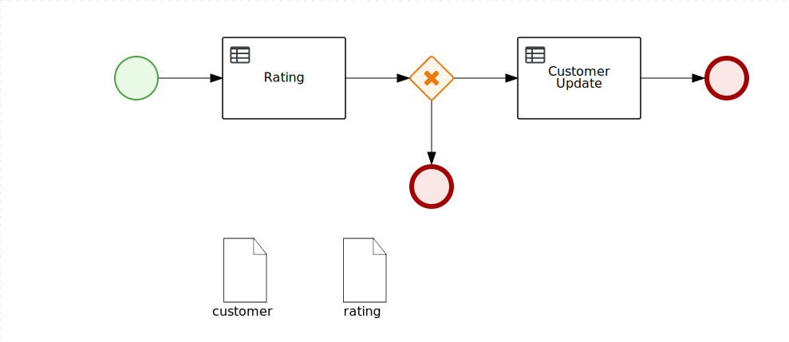

DMN Examples
=======================

## How to convert a date period in a number

To convert a date duration (period) in a number you have to divide by a duration:

```java
    duration("P10D") / duration("P1D") = 10
```

[date difference dmn](src/main/resources/com/examples/date-decision.dmn)

## How to combine multiple DMN in a flow (BPMN)

Multiple DMN can be orchestrated using a BPMN flow.



The output of the first DMN is mapped in a process variable and it's passed to the following DMN.

Another interesting feature of this the demo is the gateway which drives the following DMN execution.